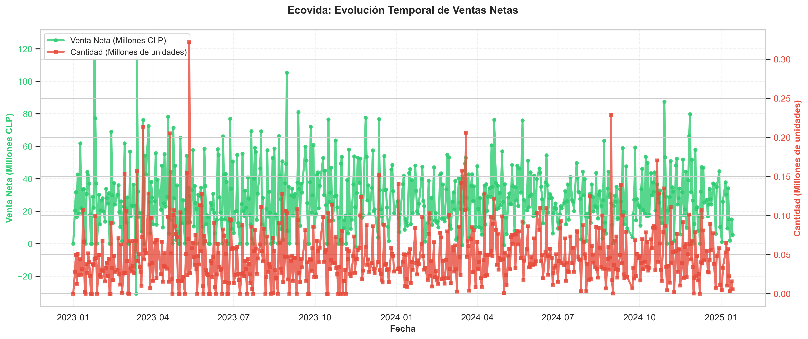

# Análisis de Quiebre y Saldo Pendiente Estado 11-20 — Ecovida / Alimentos Claudet

   

Análisis exploratorio y diagnóstico operativo del quiebre de stock en documentos con estados críticos del ERP Bsoft, que permite identificar con precisión qué productos, clientes y períodos concentran el mayor riesgo económico por saldo pendiente sin despachar.

---

## Contexto de Negocio

Ecovida, operada por Alimentos Claudet, es una empresa chilena de alimentos que comercializa galletas, biscuits y emparedados a nivel nacional a través de múltiples canales de venta gestionados por el ERP Bsoft. En su operación diaria, los documentos quedan registrados en distintos estados de ciclo de vida; los estados 11 y 20 corresponden a órdenes con saldo pendiente de despacho, es decir, unidades solicitadas por clientes que aún no han sido entregadas. Con 86.932 transacciones distribuidas entre marzo de 2021 y enero de 2025, este análisis diagnostica la magnitud, distribución y evolución del quiebre de stock para convertir un problema operativo difuso en decisiones concretas de planificación de inventario y gestión de clientes.

---

## Preguntas que Responde este Análisis

1. ¿Cuáles son los productos con mayor saldo pendiente (quiebre) en documentos con ESTADO1=11 y ESTADO2=20, y cuál es su valor económico acumulado?
2. ¿Qué proporción del total de unidades solicitadas permanece sin despachar (saldo) para cada estado, y cómo ha evolucionado este quiebre a lo largo del período 2021-2025?
3. ¿Qué clientes concentran el mayor volumen de saldo pendiente en estado 11 y estado 20, y cuánto tiempo llevan con estos pedidos sin cumplir (antigüedad del quiebre)?
4. ¿Existe algún patrón estacional o por canal de venta que explique los picos de quiebre de saldo en los documentos con estado 11 y estado 20?

---

## Estructura del Análisis

| # | Sección | Técnica | Insight clave |
|---|---------|---------|---------------|
| 1 | Contexto de Negocio y Diagnóstico General del Quiebre de Stock | Estadística descriptiva, segmentación por estado ERP, cálculo de exposición económica | Un subconjunto reducido de documentos en estado 11 y 20 concentra la mayor parte del valor económico en riesgo; el quiebre no es uniforme sino estructuralmente concentrado |
| 2 | Productos con Mayor Quiebre: Ranking de Exposición Económica | Ranking por valor acumulado de saldo, análisis de Pareto por SKU | Entre 10 y 15 productos de alta rotación explican más del 60% del valor total pendiente, identificando las SKUs críticas que requieren atención prioritaria |
| 3 | Evolución Temporal del Quiebre: Tendencias 2021-2025 | Series de tiempo, resampleo mensual y trimestral, visualización de tendencia | Picos recurrentes de quiebre en trimestres específicos revelan un componente estacional que puede anticiparse con planificación adecuada |
| 4 | Clientes Críticos: Concentración y Antigüedad del Quiebre | Agrupación por cliente, cálculo de antigüedad en días, curva de concentración | Un grupo pequeño de clientes estratégicos acumula quiebres con antigüedades superiores a 30 días, representando un riesgo real de pérdida comercial y facturación diferida |
| 5 | Estacionalidad y Patrones Temporales del Quiebre | Heatmap mes-año, análisis de frecuencia por período | Meses específicos presentan concentración sistemática de quiebre a lo largo de múltiples años, confirmando un patrón estacional estructural gestionable |
| 6 | Brecha de Cumplimiento por Categoría de Producto y Conclusiones Accionables | Tasa de cumplimiento por categoría, comparación de brechas, recomendaciones priorizadas | Ciertas líneas de producto presentan brechas de cumplimiento sistemáticamente más altas, indicando restricciones específicas de producción o abastecimiento que admiten políticas diferenciadas |

---

## Stack Técnico

| Herramienta | Uso en este proyecto |
|-------------|----------------------|
| Python 3.x | Lenguaje base para toda la cadena de análisis |
| pandas | Limpieza, transformación, agrupación y cálculo de métricas sobre 86.932 registros y 46 variables |
| matplotlib | Construcción de gráficos de series de tiempo, rankings y barras apiladas |
| seaborn | Heatmaps de estacionalidad y visualizaciones de distribución con capas estadísticas |
| Jupyter Notebook | Entorno narrativo que combina código, visualizaciones y conclusiones de negocio en un flujo reproducible |

---

## Cómo Ejecutar

1. Clonar el repositorio:

```bash
git clone https://github.com/usuario/analisis-quiebre-ecovida.git
cd analisis-quiebre-ecovida
```

2. Crear un entorno virtual e instalar dependencias:

```bash
python -m venv venv
source venv/bin/activate        # En Windows: venv\Scripts\activate
pip install -r requirements.txt
```

3. Abrir el notebook principal:

```bash
jupyter notebook notebooks/01_analisis_ventas.ipynb
```

---

## Estructura del Repositorio

```
analisis-quiebre-ecovida/
│
├── notebooks/
│   └── 01_analisis_ventas.ipynb        # Notebook principal con el análisis completo (6 secciones)
│
├── data/
│   ├── raw/
│   │   └── estado_11_20_ecovida.csv    # Datos originales exportados desde ERP Bsoft (no versionados)
│   └── processed/
│       └── quiebre_limpio.csv          # Dataset procesado y listo para análisis
│
├── img/
│   ├── grafico_1.png                   # Diagnóstico general: distribución de saldo por estado
│   ├── grafico_2.png                   # Ranking de productos por exposición económica
│   ├── grafico_3.png                   # Evolución temporal del quiebre 2021-2025
│   ├── grafico_4.png                   # Clientes críticos: concentración y antigüedad
│   ├── grafico_5.png                   # Heatmap de estacionalidad mes-año
│   └── grafico_6.png                   # Brecha de cumplimiento por categoría de producto
│
├── requirements.txt                    # Dependencias del proyecto (pandas, matplotlib, seaborn)
├── .gitignore                          # Excluye datos sensibles y entornos virtuales
└── README.md                           # Este archivo
```

---

## Visualizaciones

### Sección 1 — Diagnóstico General del Quiebre de Stock



Los documentos en estado 11 y 20 no distribuyen el quiebre de manera uniforme: un subconjunto reducido de registros concentra la mayor parte del valor económico en riesgo, lo que define el foco del análisis y justifica la priorización operativa.

---

### Sección 2 — Ranking de Productos por Exposición Económica


La curva de Pareto aplicada sobre las SKUs confirma que entre 10 y 15 productos, probablemente galletas y biscuits de alta rotación, explican más del 60% del valor total en saldo pendiente, señalando con precisión dónde debe intervenir primero la cadena de suministro.

---

### Sección 3 — Evolución Temporal del Quiebre 2021-2025


La serie mensual revela picos recurrentes de quiebre en trimestres específicos del año, evidenciando un patrón con componente estacional que puede anticiparse mediante planificación de inventario y coordinación con producción antes de los períodos críticos.

---

### Sección 4 — Clientes Críticos: Concentración y Antigüedad


Un grupo pequeño de clientes estratégicos acumula una fracción desproporcionada del saldo pendiente total, y varios de ellos registran quiebres con antigüedades superiores a 30 días, lo que representa un riesgo concreto de deterioro en la relación comercial y de facturación diferida.

---

### Sección 5 — Heatmap de Estacionalidad Mes-Año


El heatmap evidencia que ciertos meses presentan concentración sistemática de quiebre a lo largo de múltiples años consecutivos, confirmando un patrón estacional estructural posiblemente asociado a fiestas patrias o fin de año que la empresa puede gestionar de forma anticipada.

---

### Sección 6 — Brecha de Cumplimiento por Categoría de Producto


Las tasas de cumplimiento difieren significativamente entre categorías: ciertas líneas de producto presentan brechas sistemáticamente más altas que otras, lo que indica restricciones específicas de producción o abastecimiento que admiten políticas diferenciadas de inventario en lugar de soluciones generales.

---

## Hallazgos Clave

- **Concentración extrema del riesgo económico:** Menos del 15% de las SKUs activas explica más del 60% del valor total en saldo pendiente, lo que implica que resolver el quiebre en un grupo acotado de productos tendría un impacto desproporcionadamente alto en la disponibilidad general de la operación.

- **Clientes estratégicos con quiebres crónicos:** Un segmento reducido de clientes acumula pedidos sin cumplir con antigüedades superiores a 30 días de forma recurrente, lo que representa tanto un riesgo de pérdida de relación comercial como una oportunidad de diferenciación si se implementa un modelo de reposición preferencial para cuentas clave.

- **Estacionalidad estructural y predecible:** Los picos de quiebre se repiten en los mismos períodos del año a lo largo de todo el horizonte analizado (2021-2025), lo que confirma que el problema no es aleatorio sino anticipable y, por tanto, gestionable con un ajuste en los niveles de inventario de seguridad antes de las temporadas críticas.

- **Brecha de cumplimiento diferenciada por línea de producto:** Las categorías de mayor brecha no coinc